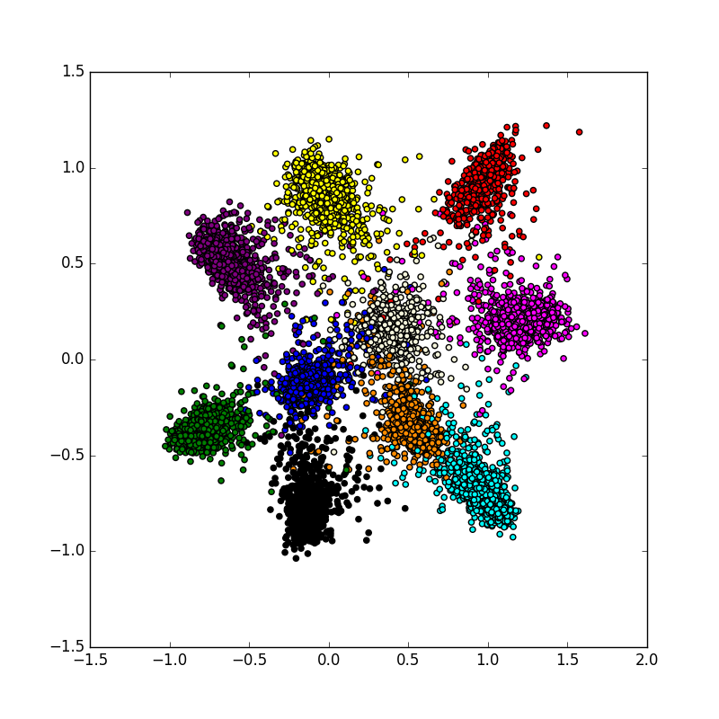

Siamese CNNs for mapping 28x28 pixel MNIST digit images to two dimensions. 

Inspired by [Hadsell 2006](http://yann.lecun.com/exdb/publis/pdf/hadsell-chopra-lecun-06.pdf)

Uses Keras

Below is a visualization of the MNIST digits after they have been sent through a trained CNN (margin=2).
The CNN has an output layer with just two nodes, allowing us to view the digits as 2-D points.

